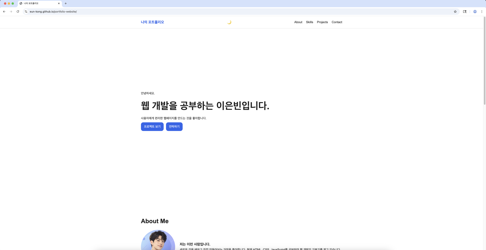
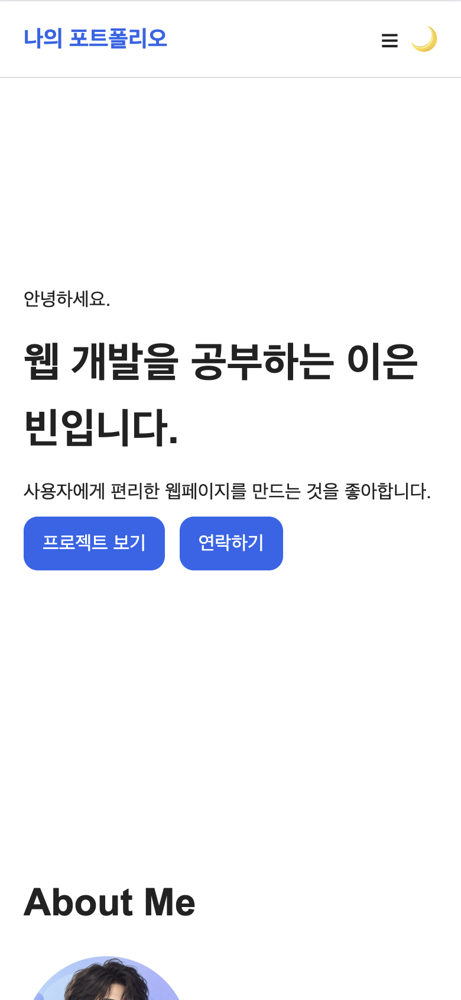
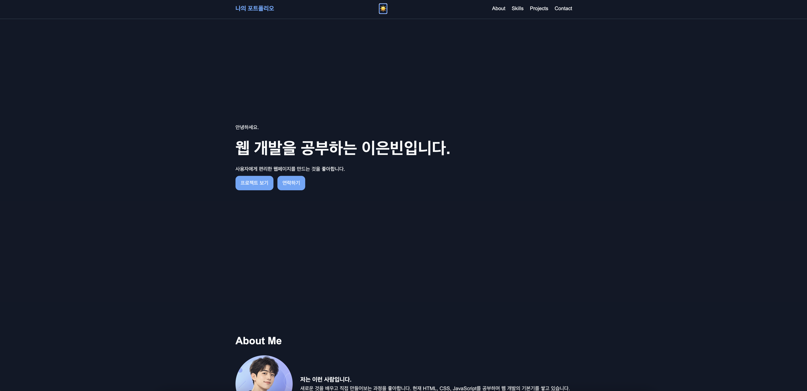

# 나의 포트폴리오 웹페이지

HTML, CSS, JavaScript를 사용해 만든 반응형 개인 포트폴리오 웹사이트입니다.

## 프로젝트 소개

웹 개발을 공부하며 배운 내용을 바탕으로 자기소개, 기술 스택, GitHub 프로젝트, 문의 폼을 하나의 웹페이지로 구현했습니다.

외부 라이브러리 없이 순수 HTML, CSS, JavaScript만 사용했습니다.

## 주요 기능

- 반응형 웹 레이아웃
- 모바일 햄버거 메뉴
- 다크 모드
- 다크 모드 설정 유지
- 부드러운 섹션 이동
- 스크롤 탑 버튼
- 스크롤 애니메이션
- 문의 폼 유효성 검사
- GitHub API 프로젝트 목록 연동
- API 로딩, 성공, 에러, 빈 상태 처리

## 사용 기술

- HTML5
- CSS3
- JavaScript ES6+
- GitHub REST API
- GitHub Pages

## 프로젝트 구조

```text
portfolio-website
├── index.html
├── css
│   └── style.css
├── js
│   └── main.js
├── images
└── README.md
```

## API 상태 처리

GitHub API 요청에 따라 다음 상태를 화면에 표시합니다.

- 로딩 상태: 프로젝트를 불러오는 중입니다.
- 성공 상태: GitHub 프로젝트 카드 표시
- 에러 상태: 프로젝트를 불러올 수 없습니다.
- 빈 상태: 표시할 프로젝트가 없습니다.

## 주요 기준값

- 스크롤 탑 버튼 표시 기준: 300px
- 네비게이션 스타일 변경 기준: 60px
- 스크롤 애니메이션 threshold: 0.2
- 태블릿 반응형 기준: 768px
- 데스크톱 반응형 기준: 1024px

## 실행 방법

1. 저장소를 내려받습니다.
2. VS Code에서 프로젝트 폴더를 엽니다.
3. `index.html`을 Live Server로 실행합니다.

## 배포 URL

https://EUN-KONG.github.io/portfolio-website/

## GitHub 저장소

https://github.com/EUN-KONG/portfolio-website

## 스크린샷

스크린샷을 촬영한 뒤 `images` 폴더에 파일을 넣고 아래 내용을 사용할 수 있습니다.

### 데스크톱 화면



### 모바일 화면



### 다크 모드


